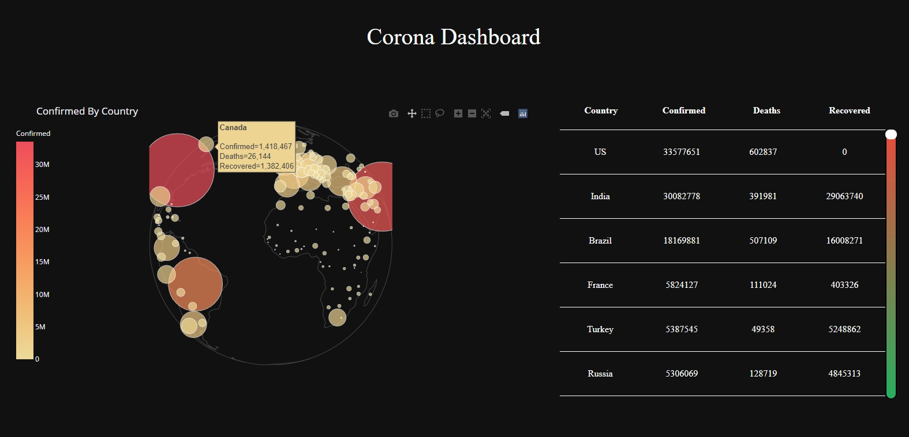
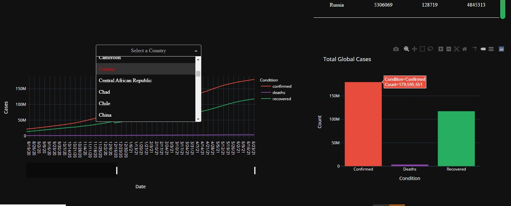

# rona-dashboard

Corona-dashborad using Python, Pandas, Dash and Plotly

Demo: https://ronarona-dashboard.herokuapp.com/

 

1. Created bubble map and table by using CSSE covie19 daily reports data.

2. Visualized Times series summary of covid19 data with line graph and bar graph.

Data source

1. CSSE covie19 daily reports: 
https://github.com/CSSEGISandData/COVID-19/tree/master/csse_covid_19_data

2. Time series summary(Clobal confirmed, deacth and recover):
https://github.com/CSSEGISandData/COVID-19/tree/master/csse_covid_19_data/csse_covid_19_time_series
